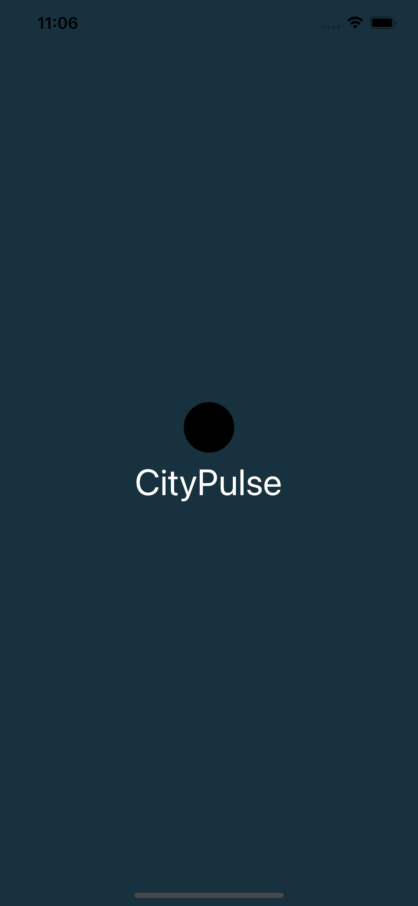
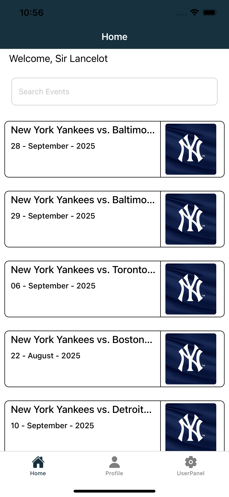
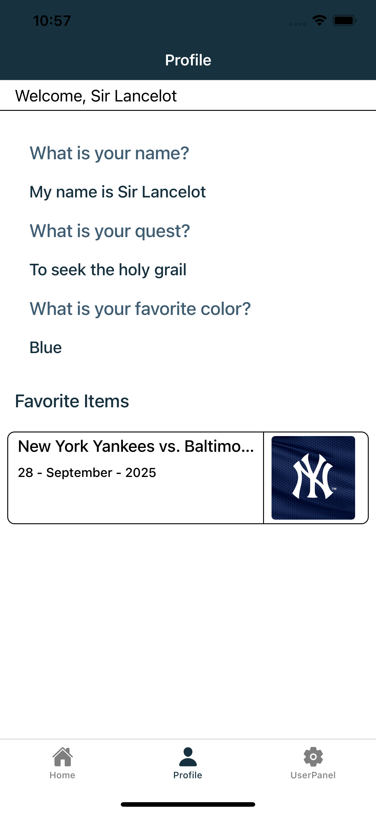
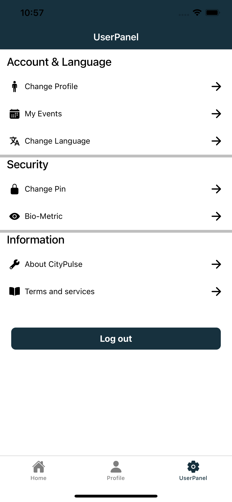
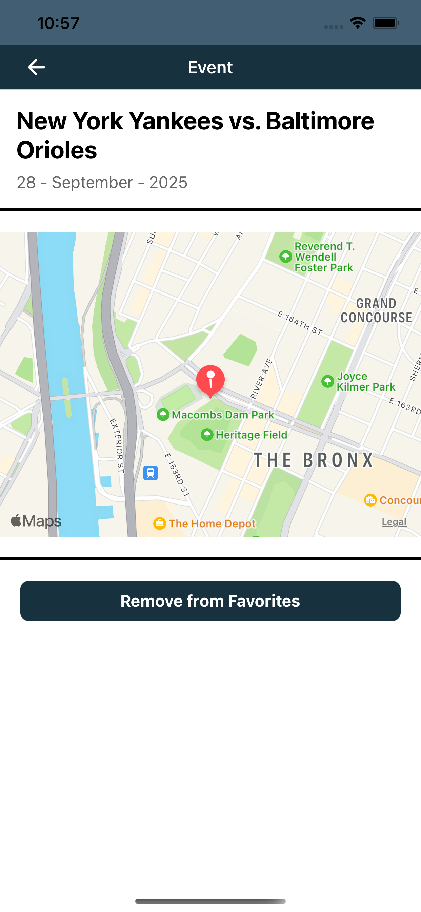
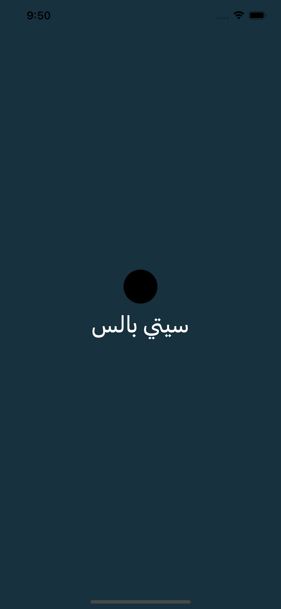
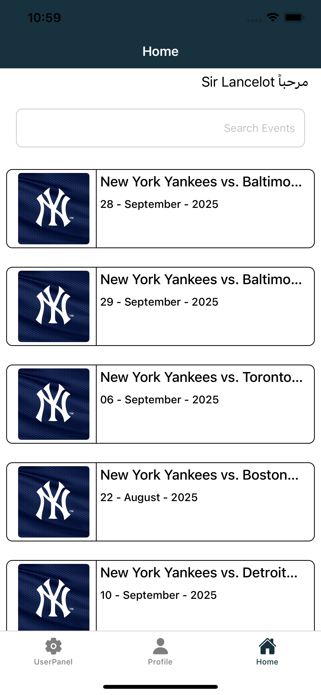
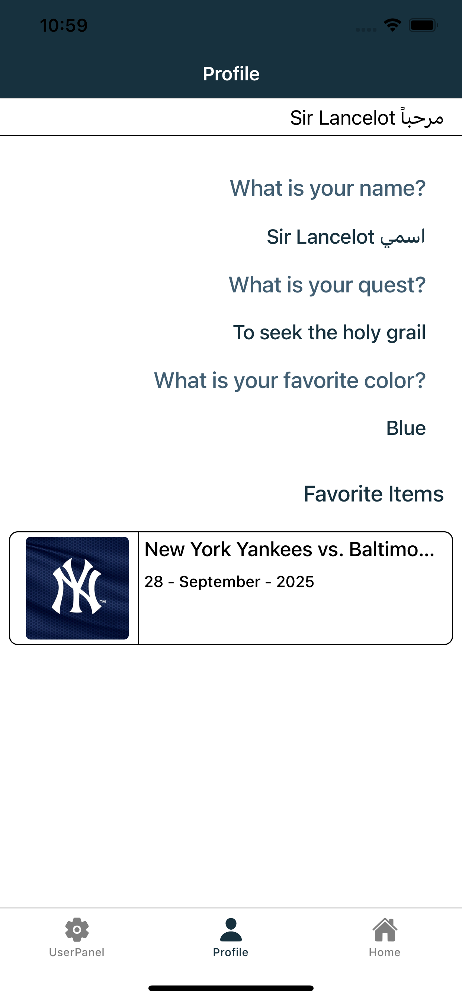
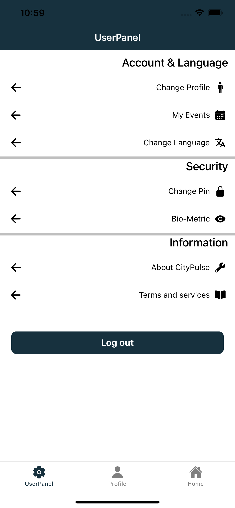

# City Pulse

  
  
  
  
  

### With RTL support

  
  
  

Short video demo: https://drive.google.com/file/d/1qKdDFjsbGMSc2cH6Y0uTXd-E1p7ArAmx/view?usp=sharing

Demo App for City Events based exploration apps

Demo is build using the following environment:

- Nodejs ver 20+
- MacBook M1 2020, Sonoma 14.5
- Xcode 16.0
- CocoaPods: 1.15.2

## Used Libraries

- @Tanstack React-Query
- React-Navigation
- Zustand for State Management
- react-native-mmkv for Local Storage
- Axios for API Client
- @react-native-vector-icons/ionicons
- and others...

## Assumptions & Limitations

- Not all text are using Translation component due to time constraint
- Public API key is currently store in .env which is not where it supposed to be, but for the purpose of easier testing it stays for now
- Mock Login & register is implemented, no Password check. Registering with the same username might overwrite the old storage with the new one
- User has their own storage container, this means User may store their data based on password, theres no password check but if they used different password, it might result with different storage data
- TextInput with secureTextEntry in simulator may shows unremoveable view with "Strong Password" because iPhone autofill, see: https://github.com/facebook/react-native/issues/21911
- Not tested for android development
- Several library have not been implemented (keyboard-controller, edge-to-edge) due to not testing for android development at the moment

## Instructions

0. open the project folder using terminal
1. run `npm run install`, post-script should also install cocoaPods
2. run `npm run ios` or alternatively open Xcode and open CityPulse/ios/CityPulse.xcworkspace and Run the app from Xcode
